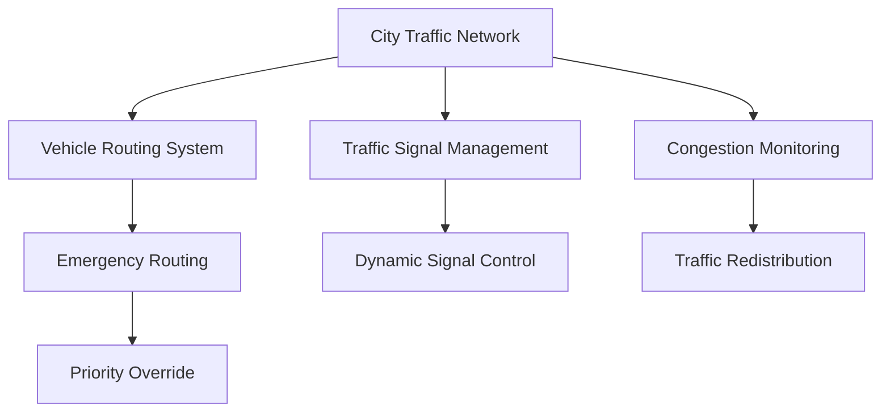
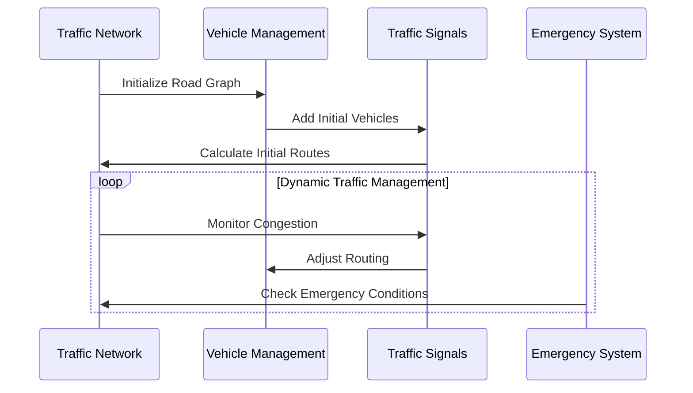

# 🚦 Smart Traffic Management System Simulator

## 🌆 Project Overview

The Smart Traffic Management System Simulator is an advanced urban traffic optimization platform that leverages sophisticated data structures to create a dynamic, real-time traffic management solution. By simulating complex traffic scenarios, this project provides insights into urban mobility and traffic flow optimization.


## 🚗 Key Features

### 🗺️ City Traffic Network (Graph Representation)
- **Intelligent Infrastructure Mapping**
  - Nodes represent intersections
  - Edges represent roads with dynamic weight calculations
  - Real-time network adaptability
- **Visualization Capabilities**
  - Text-based graph structure representation
  - Dynamic network modifications
    


### 🧭 Advanced Vehicle Routing
- **Intelligent Infrastructure Mapping**
  - Integrates dynamic route recalculation to respond to real-time road additions.
  - Implements Dijkstra's Algorithm for optimal route selection, minimizing travel time or distance.
- **Adaptive Routing**
  - Monitors traffic conditions to adjust vehicle paths dynamically.
  - Avoids congested areas and provides congestion-aware paths for efficient traffic flow.
    


### 🚦 Smart Traffic Signal Management
- **Intelligent Signal Control**
  - Allocates green signal time based on the volume of traffic in each direction.
  - Reduces idle time at intersections, ensuring smooth traffic flow.
- **Emergency Priority System**
  - Instantly overrides normal signal operations to give priority to emergency or critical situations.
  - Reduces response times during critical situations.
        


### 🔍 Congestion Monitoring System
- **Real-Time Analysis**
  - Uses hash table structures for efficient congestion identification and density tracking.
  - Provides insights into specific high-traffic areas across the network.
- **Traffic Redistribution**
  - Automated rerouting using BFS/DFS algorithms
  - Congestion level visualization to help understand and monitor traffic situations
        


### 🚨 Emergency Vehicle Handling
- **Rapid Response Routing**
  - Implements Dijkstra's Algorithm for the fastest route identification.
  - Factors in real-time road closures and traffic conditions to minimize delays.
- **Prioritized Path Calculations**
  - Assigns emergency vehicles the shortest path with minimal obstructions.


### 🚧 Dynamic Road Condition Simulation
- **Network Disruption Modeling**
  - Simulates real-world challenges such as road closures, accidents, or construction activities.
  - Updates the road graph to reflect disruptions and reconfigures routes accordingly.
- **Adaptive Routing Strategies**
  - Employs adaptive algorithms to redirect vehicles around disruptions, maintaining optimal flow.
  - Offers a detailed view of network changes and their impact on overall traffic patterns.


## 🛠️ Structures and Algorithms Used

### 🏗️ Data Structures:
1. **Adjacency Matrix**:
   - Used to store the road network graph efficiently, enabling quick lookups of connections between nodes.
2. **Hash Table**:
   - Efficiently tracks the number of vehicles present at each node (intersection), ensuring fast updates and retrieval.
3. **Priority Queue**:
   - Manages the priority of emergency vehicles, ensuring they are processed based on urgency.
4. **Min-Heap**:
   - Finds the most congested roads in the network by maintaining road congestion levels in ascending order.

### 🧭 Algorithms:
1. **Dijkstra's Algorithm**:
   - Computes the shortest path between nodes, optimizing travel routes for vehicles and emergency services.
2. **Breadth-First Search (BFS)**:
   - Detects congestion zones across the network by analyzing traffic density at intersections and roads.
---
## 🛠️ Technical Architecture



## 📦 System Requirements

### Development Environment
- **Compiler**: GNU G++ (C++11 or later)
- **Platform**: Ubuntu/Linux/Windows
- **Dependencies**: 
  - None
### Installation

1. **Compile the Project**
   ```bash
   make build
   ```
   or alternatively:
   ```bash
   g++ main.cpp trafficSignal.cpp trafficNetwork.cpp congestion.cpp roadClosures.cpp EVHandling.cpp dashboard.cpp -o TrafficManagement
   ```

2. **Run the Simulator**
   ```bash
   ./TrafficManagement
   ```

## 🚦 Simulation Workflow


## 🌟 Acknowledgments
- Abubakar Imran
- Huzaifa Khalid
- Waqas Ahmed
---
