# 🚦 Smart Traffic Management System Simulator

## 🌆 Project Overview

The Smart Traffic Management System Simulator is an advanced urban traffic optimization platform that leverages sophisticated data structures to create a dynamic, real-time traffic management solution. By simulating complex traffic scenarios, this project provides insights into urban mobility and traffic flow optimization.

## 🚗 Key Features

### 🗺️ City Traffic Network (Graph Representation)
- **Intelligent Infrastructure Mapping**
  - Nodes represent intersections
  - Edges represent roads with dynamic weight calculations
  - Real-time network adaptability
- **Visualization Capabilities**
  - Text-based graph structure representation
  - Dynamic network modifications

### 🧭 Advanced Vehicle Routing
- **Pathfinding Algorithms**
  - Dijkstra's Algorithm for optimal route selection
  - Dynamic route recalculation
- **Adaptive Routing**
  - Real-time traffic condition adjustments
  - Congestion-aware path selection

### 🚦 Smart Traffic Signal Management
- **Intelligent Signal Control**
  - Priority-based traffic light management
  - Dynamic green signal duration optimization
- **Emergency Priority System**
  - Immediate signal overrides for critical vehicles

### 🔍 Congestion Monitoring System
- **Real-Time Analysis**
  - Continuous vehicle density tracking
  - Hash table-based congestion identification
- **Traffic Redistribution**
  - Automated rerouting using BFS/DFS algorithms
  - Congestion level visualization

### 🚨 Emergency Vehicle Handling
- **Rapid Response Routing**
  - A Search Algorithm for fastest emergency routes
  - Automatic traffic signal preemption
- **Prioritized Path Calculations**
  - Minimal delay routing for critical vehicles

### 🚧 Dynamic Road Condition Simulation
- **Network Disruption Modeling**
  - Simulate road closures and accidents
  - Instant network reconfiguration
- **Adaptive Routing Strategies**
  - Automatic vehicle rerouting
  - Comprehensive network state updates

## 🛠️ Technical Architecture

```mermaid
graph TD
    A[City Traffic Network] --> B[Vehicle Routing System]
    A --> C[Traffic Signal Management]
    A --> D[Congestion Monitoring]
    B --> E[Emergency Routing]
    C --> F[Dynamic Signal Control]
    D --> G[Traffic Redistribution]
    E --> H[Priority Override]
```



## 📦 System Requirements

### Development Environment
- **Compiler**: GNU G++ (C++11 or later)
- **Platform**: Ubuntu/Linux
- **Dependencies**: 
  - ncurses library

### Installation

1. **Install Dependencies**
   ```bash
   sudo apt update
   sudo apt install build-essential libncurses5-dev libncursesw5-dev
   ```

2. **Compile the Project**
   ```bash
   make build
   ```
   or alternatively:
   ```bash
   g++ main.cpp trafficSignal.cpp trafficNetwork.cpp congestion.cpp roadClosures.cpp -o TrafficManagement
   ```

4. **Run the Simulator**
   ```bash
   ./TrafficManagement
   ```

## 🚦 Simulation Workflow


## 🌟 Acknowledgments
- Abubakar Imran
- Huzaifa Khalid
- Waqas Ahmed
- Dedicated to improving city transportation systems

---
